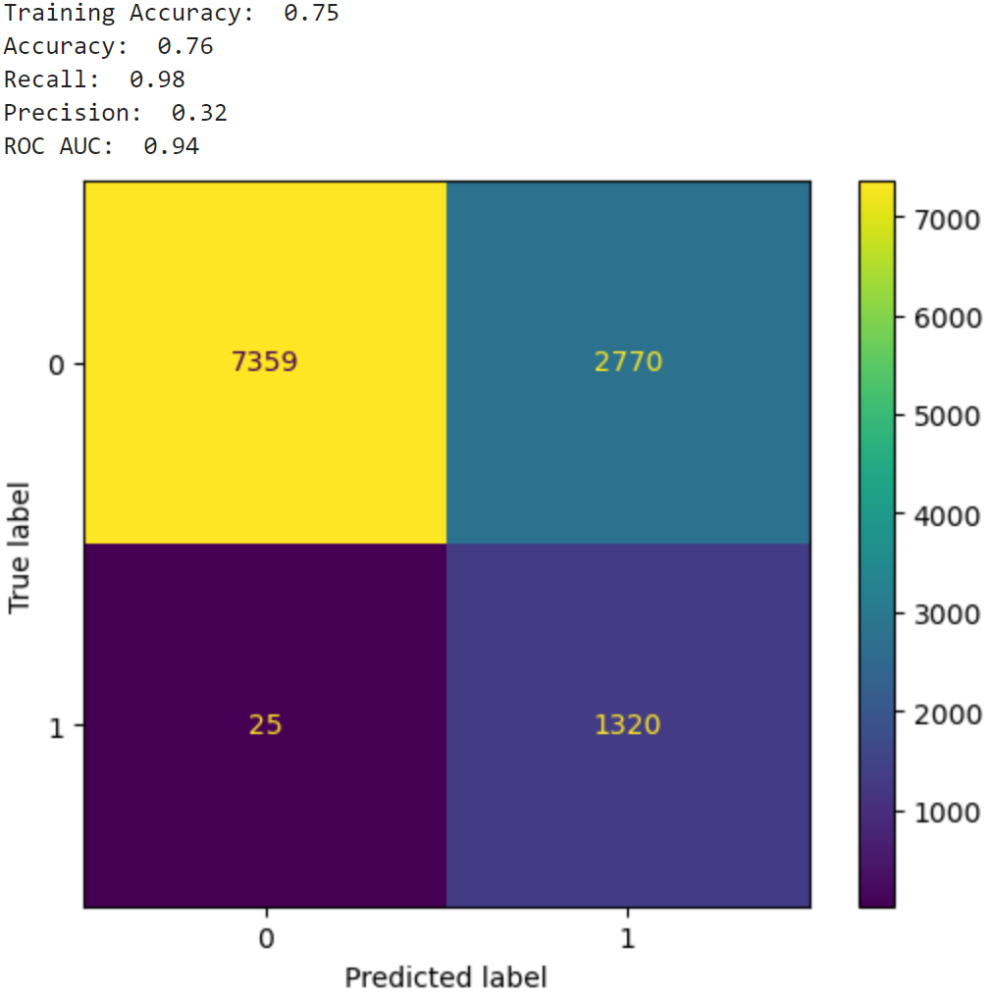
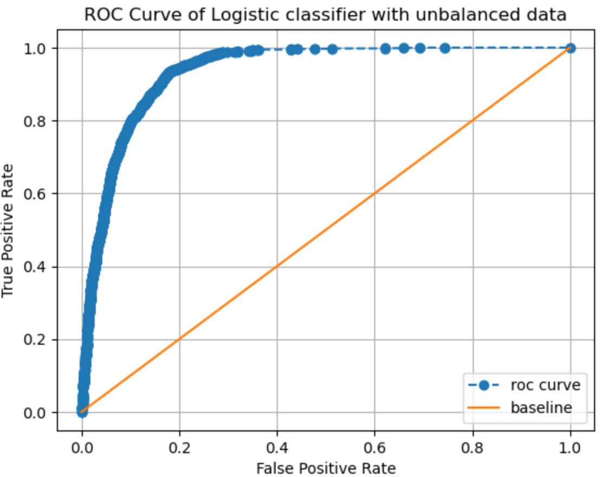
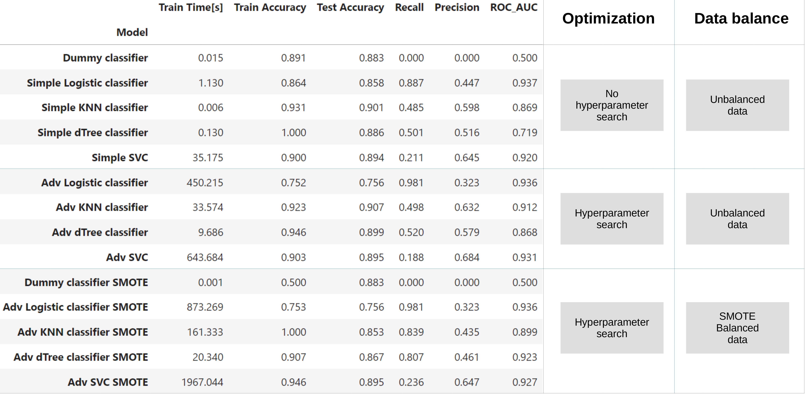
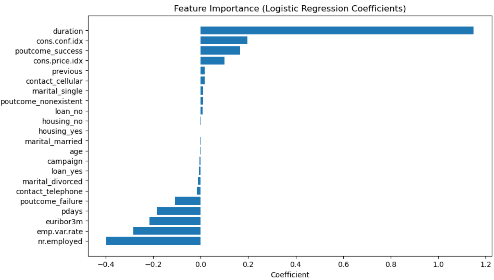
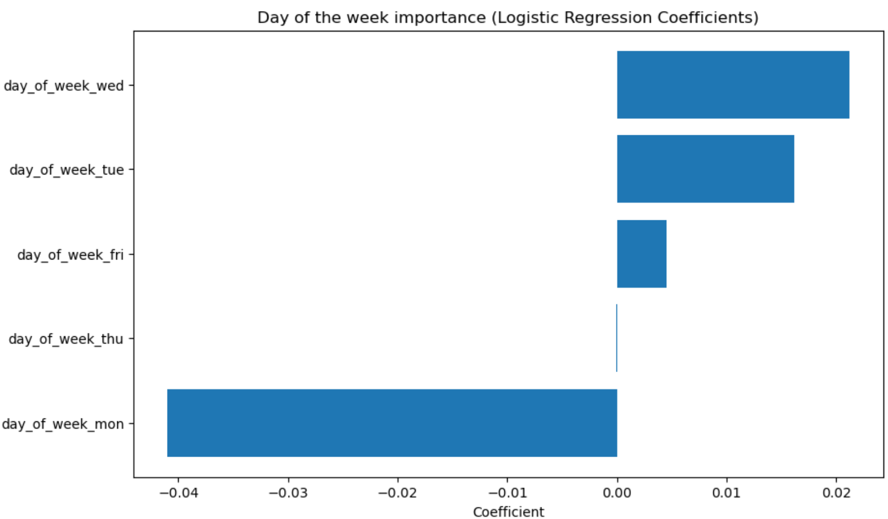
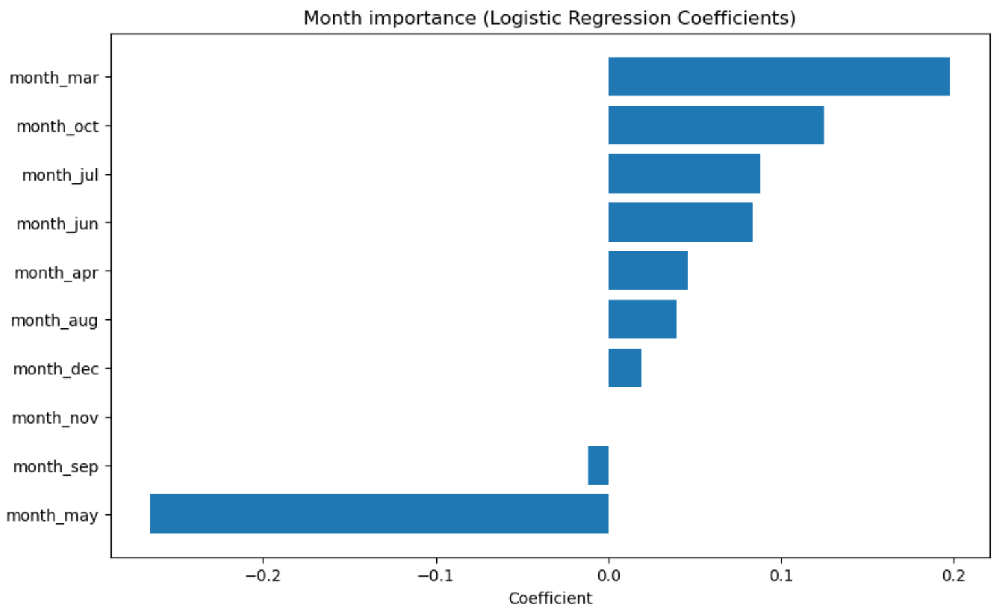
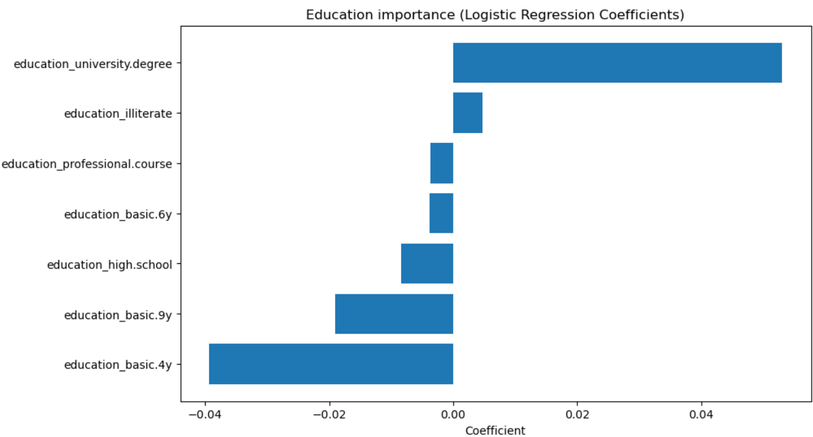

# Precision Marketing in Banking: Optimizing Customer Outreach by Predicting Long-Term Deposit Subscribers with Data-Driven Insights

### Link to analysis:
https://github.com/AdrianGrzybowski/Banking_ML_exercise/blob/main/Analysis.ipynb

### Dataset:
https://archive.ics.uci.edu/dataset/222/bank+marketing
	
	The dataset was collected from a Portuguese bank that conducted marketing campaigns through its contact center, primarily using telephone interactions with human agents. Occasionally, the bank also leveraged online banking as an auxiliary channel to provide targeted clients with specific information. These campaigns were managed in an integrated manner, and the results were compiled across all channels.

	The data spans 17 campaigns conducted between May 2008 and November 2010, totaling 79,354 contacts. The campaigns promoted a long-term deposit product with attractive interest rates. A wide range of attributes was recorded for each contact, and the outcome of whether the campaign was successful (i.e., if the client subscribed) was tracked. Overall, 6,499 successes were recorded, resulting in an 8% success rate.

### Business Objectives:
	Business objective is to improve the efficiency of bank direct marketing campaigns. Specifically, the goal is to reduce the number of customer contacts while maintaining or increasing the number of successful long-term deposit subscriptions. By building predictive models using data mining, the bank can identify key factors that influence customer responses, enabling more targeted and resource-efficient campaigns. This will ultimately enhance marketing performance, reduce costs, and optimize resource allocation.

### Evaluation metrics rationale:
	1.ROC AUC is a suitable metric for evaluating the overall discriminatory power of the model, where identifying customers likely to subscribe to long-term deposits is essential. It provides a robust measure of the model's ability to distinguish between customers who will respond positively (subscribe) and those who will not. The higher the ROC AUC, the better the model is at correctly ranking customers by their likelihood to respond, regardless of the decision threshold.
	2.Recall is particularly important in this scenario because the primary goal is to capture as many potential deposit subscribers as possible. A high recall ensures that the model identifies the majority of customers who are likely to subscribe, even if it means contacting some customers who won’t subscribe (i.e., increasing false positives).

### Model rationale:
	From among LogisticRegression, KNeighborsClassifier, DecisionTreeClassifier and SVC, the best results have been achieved for LogisticRegression classification. For the task of predicting clients interested in opening long term deposit, Logistic regression classifier provided the best ROC AUC = 0.94, with very favorable curve allowing for nearly perfect recall = 0.98, while maintaining acceptable precision = 0.32. 

### Summary of all models:

### Observations:
	1.The best predictive model, as measured by ROC AUC, was achieved with Logistic Regression (ROC AUC = 0.94), followed by SVM (ROC AUC = 0.93), Decision Tree (ROC AUC = 0.92), and KNN (ROC AUC = 0.91). Furthermore, KNN classifier appeared to have trouble achiving high recall score making it the least favorable. 
	2.For the best model (Logistic Regression), at recall = 0.98, we achieved precision = 0.32, meaning we can identify most customers, considering that baseline acceptance rate was 0.12, at precision of 0.32, we can perform 2.6 times fewer calls to achieve nearly the same results.  
	3.I attempted balancing the training dataset using the Synthetic Minority Oversampling Technique (SMOTE), which appeared to improve the Decision Tree classifier. Other models did not benefit from data balancing.
	4.Based on Logistic Regression coefficients, the most important features were: employment variation rate (negative correlation), Euribor 3-month rate (positive correlation), consumer price index (positive correlation), last contact duration (positive correlation), previous outreach success (positive correlation), number of employees (negative correlation), and the number of days since the client was last contacted from a previous campaign (negative correlation).
	5.It should be noted that last contact duration is strongly associated with success, but it may not be a valuable predictive parameter.
	6.Macroeconomic features like the Euribor 3-month rate, employment, and consumer sentiment, while strongly predictive, may not be useful for customer stratification as they are common for all customers at a given date.
	7.The level of customer education had a weak effect, with higher education being positively correlated.
	8.Customers’ jobs had a weak effect, with being retired or a student positively correlated, and blue-collar and service jobs negatively correlated.
	9.The day of the week had a weak effect, with Monday being less preferred.
	10.The month of contact had a weak effect, with May being less preferred. However, there is no clear explanation, as neighboring months (April and June) do not follow the same trend, indicating it might be a serendipitous correlation.
	11.Many features had negligible effects on success, including housing loan, marital status, personal loan, contact communication type, and the number of contacts during and before the campaign.
	12.Considering the negligible effect of multiple contacts, it might be beneficial to cap the number of times a person is contacted during a single campaign, as more frequent contacts do not translate into higher success. Perhaps contacting people more sporadically across multiple campaigns would lead to better results. In the current campaign on average 2.6 calls have been performed per customer, whereas it seems that a single call would have simillar effect. 

### Future Directions:
	1.I would recommend building the model without macroeconomic features as they are common for all customers. While they are informative for general predictions of success, they do not help in stratifying customers who are most likely to sign a deal.
	2.For customer stratification, I would also refrain from using call duration as it does not seem to be known ahead of time.
	3.The clients are highly sensitive to macroeconomic indicators, suggesting that personal finances might influence their decision on when to open a long-term deposit. It might be beneficial to augment data collection for future campaigns with other information related to the customer’s economic situation, such as income, credit score, age of their car, whether they have children, etc. This could help create a much more predictive model for identifying customers' willingness to open long-term deposits.

### Feature importance based on Logistic Regression:

#### Input variables:

##### bank client data:
	1 - age (numeric)
	2 - job : type of job (categorical: 'admin.','blue-collar','entrepreneur','housemaid','management','retired','self-employed','services','student','technician','unemployed','unknown')
	3 - marital : marital status (categorical: 'divorced','married','single','unknown'; note: 'divorced' means divorced or widowed)
	4 - education (categorical: 'basic.4y','basic.6y','basic.9y','high.school','illiterate','professional.course','university.degree','unknown')
	5 - default: has credit in default? (categorical: 'no','yes','unknown')
	6 - housing: has housing loan? (categorical: 'no','yes','unknown')
	7 - loan: has personal loan? (categorical: 'no','yes','unknown')
##### related with the last contact of the current campaign:
	8 - contact: contact communication type (categorical: 'cellular','telephone')
	9 - month: last contact month of year (categorical: 'jan', 'feb', 'mar', ..., 'nov', 'dec')
	10 - day_of_week: last contact day of the week (categorical: 'mon','tue','wed','thu','fri')
	11 - duration: last contact duration, in seconds (numeric). Important note: this attribute highly affects the output target (e.g., if duration=0 then y='no'). Yet, the duration is not known before a call is performed. Also, after the end of the call y is obviously known. Thus, this input should only be included for benchmark purposes and should be discarded if the intention is to have a realistic predictive model.
##### other attributes:
	12 - campaign: number of contacts performed during this campaign and for this client (numeric, includes last contact)
	13 - pdays: number of days that passed by after the client was last contacted from a previous campaign (numeric; 999 means client was not previously contacted)
	14 - previous: number of contacts performed before this campaign and for this client (numeric)
	15 - poutcome: outcome of the previous marketing campaign (categorical: 'failure','nonexistent','success')
##### social and economic context attributes
	16 - emp.var.rate: employment variation rate - quarterly indicator (numeric)
	17 - cons.price.idx: consumer price index - monthly indicator (numeric)
	18 - cons.conf.idx: consumer confidence index - monthly indicator (numeric)
	19 - euribor3m: euribor 3 month rate - daily indicator (numeric)
	20 - nr.employed: number of employees - quarterly indicator (numeric)

##### Output variable (desired target):
	21 - y - has the client subscribed a term deposit? (binary: 'yes','no')

#### Importance:

